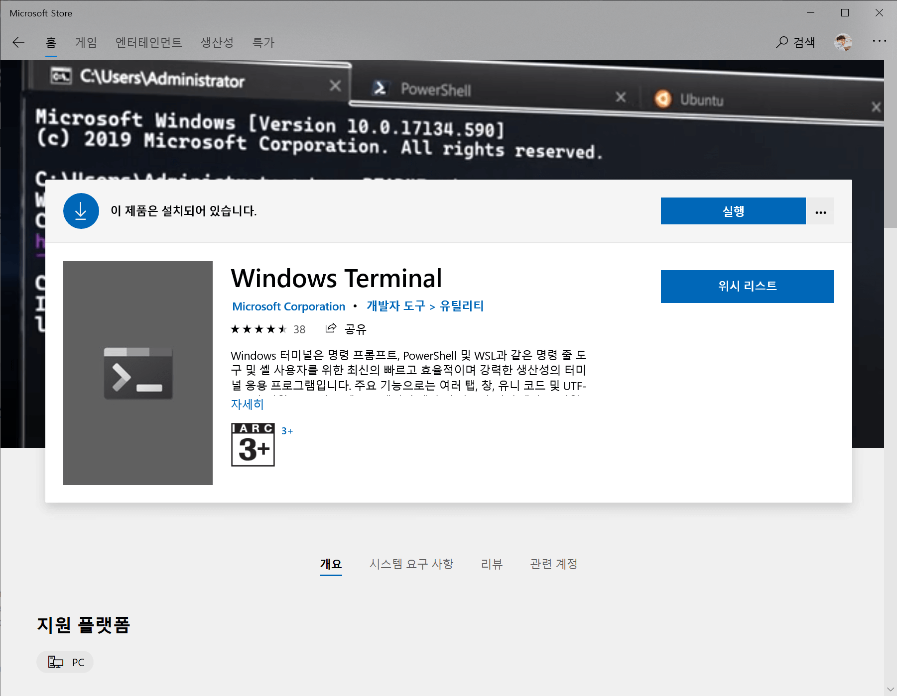
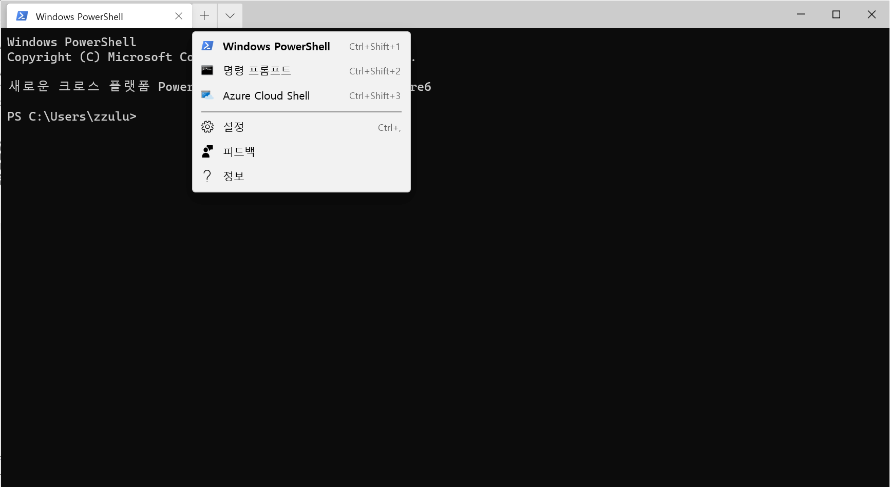
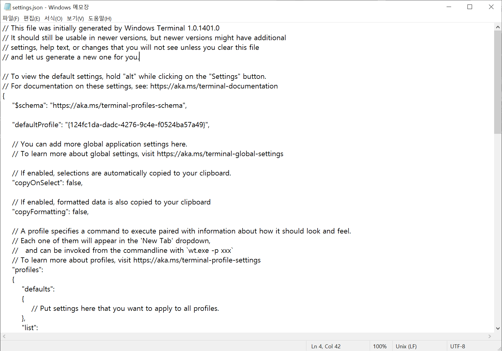
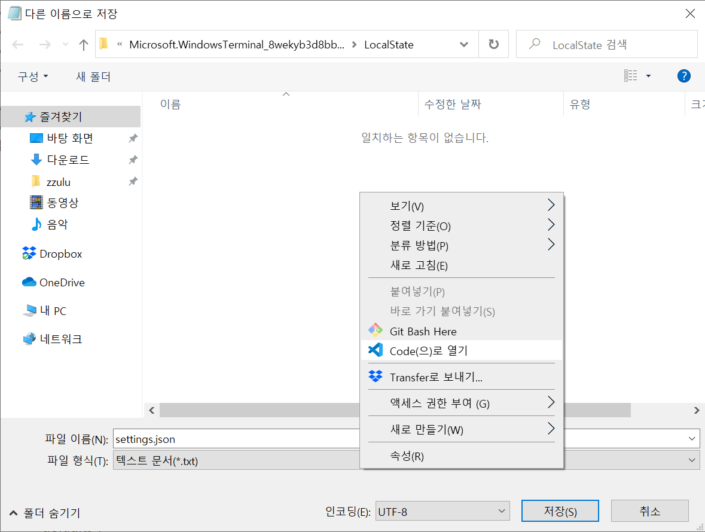
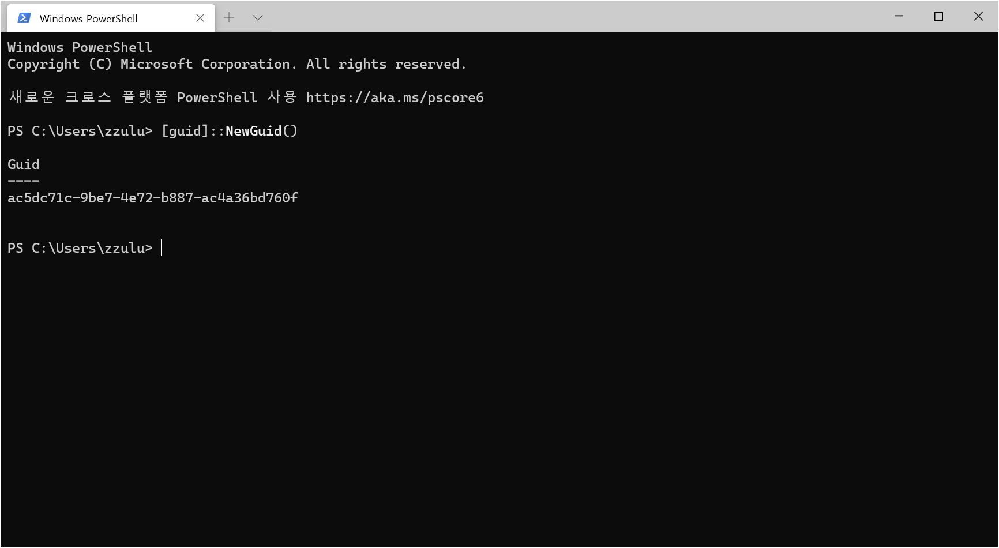
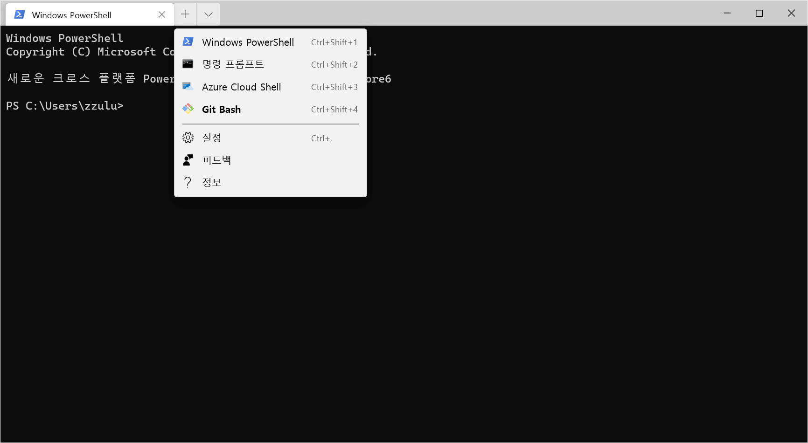
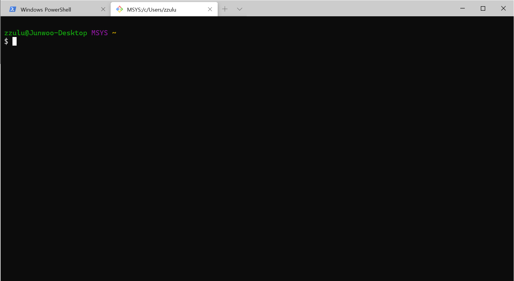

> Git Bash가 설치되어 있어야 합니다.

## 1. Windows Terminal 설치

[Microsoft Store](https://www.microsoft.com/store/productId/9N0DX20HK701)에서 **Windows Terminal**을 설치합니다.




## 2. Windows Terminal 실행

처음 실행하면 기본으로 PowerShell, CMD, Azure Cloud Shell을 사용할 수 있도록 되어 있습니다.



설정을 통해 추가적인 Shell(Bash)을 사용할 수 있도록 해봅시다.


## 3. Windows Terminal 설정

`설정` 메뉴를 클릭하거나 `ctrl + ,` 단축키를 사용하여, 설정 파일을 열 수 있습니다.



메모장으로 열리기 때문에 편집이 불편할 수 있습니다. 다른 에디터를 사용하실 분들은 `다른 이름으로 저장` 메뉴 또는 `ctrl + shift + s` 단축키를 사용하여 '다른 이름으로 저장' 창을 열고, 해당 위치를 원하는 에디터로 열어 설정 파일을 편집합니다. 여기서는 VS Code를 사용하겠습니다. `Code로 열기` 컨텍스트 메뉴를 통해 VS Code에서 설정 파일이 존재하는 폴더를 열어 줍니다.



`profiles` 항목에 `Git Bash` 프로필을 추가합니다.

```json
{

    "profiles":
    {
        "defaults":
        {
            
        },
        "list":
        [
            {
                "guid": "{61c54bbd-c2c6-5271-96e7-009a87ff44bf}",
                "name": "Windows PowerShell",
                "commandline": "powershell.exe",
                "hidden": false
            },
            {
                "guid": "{0caa0dad-35be-5f56-a8ff-afceeeaa6101}",
                "name": "명령 프롬프트",
                "commandline": "cmd.exe",
                "hidden": false
            },
            {
                "guid": "{b453ae62-4e3d-5e58-b989-0a998ec441b8}",
                "hidden": false,
                "name": "Azure Cloud Shell",
                "source": "Windows.Terminal.Azure"
            },
            {
                "guid": "{124fc1da-dadc-4276-9c4e-f0524ba57a49}",
                "name": "Git Bash",
                "commandline": "\"%PROGRAMFILES%\\git\\usr\\bin\\bash.exe\" -i -l",
                "icon": "%PROGRAMFILES%\\git\\mingw64\\share\\git\\git-for-windows.ico",
                "startingDirectory": "%USERPROFILE%",
                "cursorShape": "filledBox",
                "hidden": false
            }
        ]
    },

}
```

이 때 프로필의 `guid`는 해당 프로필의 고유 아이디이며, 저 포멧을 사용하고 다른 값과 중복되지만 않으면 어떠한 값도 사용 가능합니다. 위의 guid를 그대로 사용해도 되지만, 새롭게 생성하고 싶으신 분들은 PowerShell에서 아래의 명령어를 입력하여 새롭게 생성할 수 있습니다.

```powershell
[guid]::NewGuid()
```



다양한 프로필 설정법은 [https://aka.ms/terminal-profile-settings](https://aka.ms/terminal-profile-settings) 에서 확인 가능합니다.

저장을 하고 나면 아래와 같이 `Git Bash`가 추가된 것을 확인할 수 있습니다.

 

## 4. 기본 프로필 설정

- 새 탭을 열었을 때 기본으로 나오는 프로필을 변경하려면, 기본으로 설정하고자 하는 프로필의 `guid`를 `defaultProfile` 키의 값으로 지정하면 됩니다.

```json
{

    "defaultProfile": "[guid]",    

    "defaultProfile": "{124fc1da-dadc-4276-9c4e-f0524ba57a49}",

}
```
